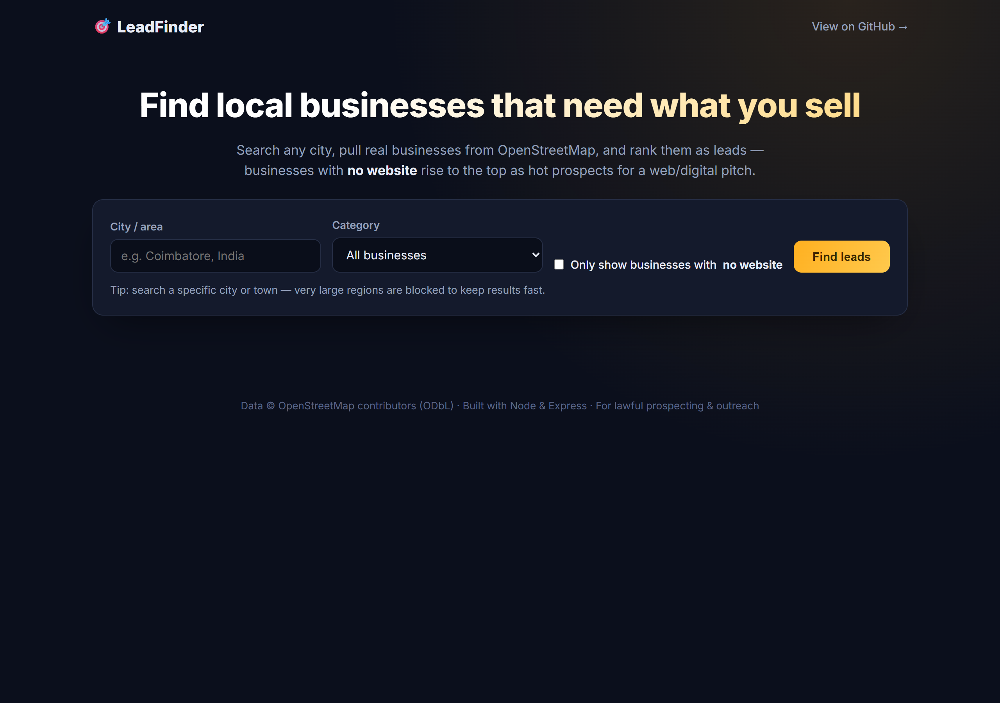
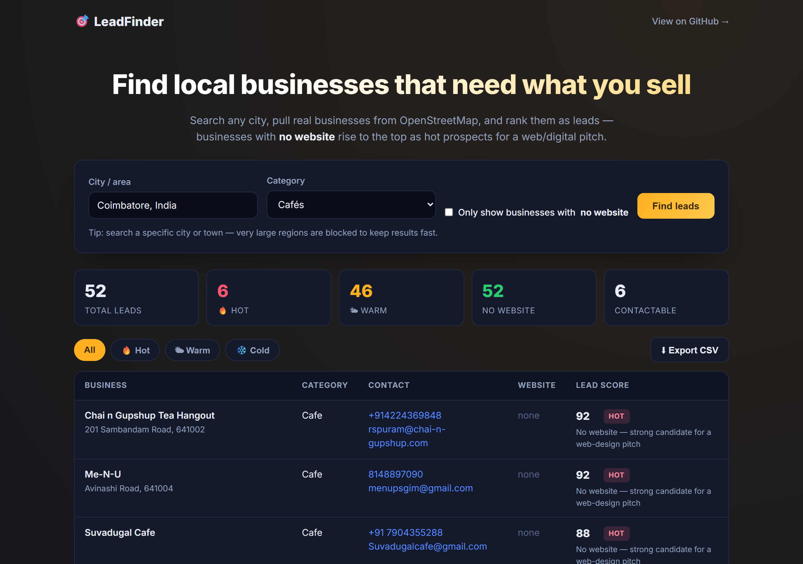

# 🎯 LeadFinder - Local Business Lead Generator

> Search any city, pull **real local businesses** from OpenStreetMap, and rank them as **sales leads** - businesses with **no website** rise to the top as hot prospects for a web/digital pitch. Filter, review, and **export to CSV**.

A practical prospecting tool that turns open map data into a working lead pipeline: **discover → clean → score → dashboard → export**. No paid APIs, no scraping of terms-protected sites.


---

## ✨ Why this project

This mirrors a real agency workflow (the kind of pipeline you'd build for a digital-services business) - but built **ethically and for free**:

- **Real data, no paid API, no ToS violation.** It uses the open **Overpass** + **Nominatim** APIs (OpenStreetMap), not Google Maps scraping.
- **Opinionated lead scoring.** It's not just a list - each business gets a **0-100 lead score** and a **hot / warm / cold** tier, tuned for selling websites: *no website + reachable by phone = your hottest lead.*
- **Actionable output.** Filter by tier and **export a clean CSV** ready for a CRM or outreach sequence.

---

## 🖥️ Demo

`npm start` → <http://localhost:3003>. Try **"Coimbatore, India"** + category **Restaurants**, or tick *"Only businesses with no website"* to see pure prospects.

### Screenshots

| Search a city + category | Scored leads + CSV export |
| :---: | :---: |
|  |  |

---

## 🧮 How leads are scored

| Signal | Effect | Rationale |
| --- | --- | --- |
| **No website** | **+50** | They need exactly what you sell - the core opportunity. |
| Phone available | +22 | You can actually reach them. |
| Email available | +16 | Reachable for outreach sequences. |
| Social-only (no site) | +10 | Active online but missing a website - obvious gap. |
| Verified address | +4 | Higher-quality, real record. |
| Has website | +8 | Still a redesign/upsell lead, lower priority. |

**Tiers:** 🔥 Hot ≥ 70 · 🌤 Warm 40-69 · ❄️ Cold < 40. Each lead carries human-readable reasons for its score.

---

## 🚀 Quick start

```bash
git clone https://github.com/<you>/ai-lead-generator.git
cd ai-lead-generator
npm install
npm start          # → http://localhost:3003
npm test           # 10 unit tests (parsing + scoring), no network
```

No API key required.

---

## 🔌 API

| Endpoint | Params | Purpose |
| --- | --- | --- |
| `GET /api/search` | `place`, `category`, `onlyMissingWebsite` | Returns `{ place, summary, leads[] }`. |
| `GET /api/export` | same | Streams a downloadable **CSV** of the leads. |
| `GET /api/health` | - | `{ status, categories[] }`. |

Categories: `restaurant, cafe, bar, hotel, salon, gym, dentist, doctor, retail, bakery, car_repair, any`.

---

## 🏗️ How it works

```
  place + category
        │
        ▼
  Nominatim geocode  ──►  bounding box  (rejects regions that are too large)
        │
        ▼
  Overpass API query  ──►  raw OSM business elements
        │
        ▼
  leads.js (pure)     ──►  clean · dedupe · score · sort
        │
        ├──►  dashboard (filter by tier)
        └──►  CSV export
```

**Stack:** Node.js + Express · global `fetch` · OpenStreetMap Overpass & Nominatim · vanilla dashboard · `node:test`.

---

## ⚖️ Data & ethics

- Business data is **© OpenStreetMap contributors**, licensed under the **ODbL** - attribute it when you publish results.
- Be a good API citizen: the app sends a descriptive `User-Agent`, limits result sizes, and **blocks oversized areas** to respect the free public Overpass/Nominatim endpoints. For heavy use, run your own Overpass instance.
- Use the leads for **lawful, consensual outreach** and follow local anti-spam / telemarketing rules (e.g. honour do-not-call lists).

## 📜 License

MIT - see [LICENSE](LICENSE).
